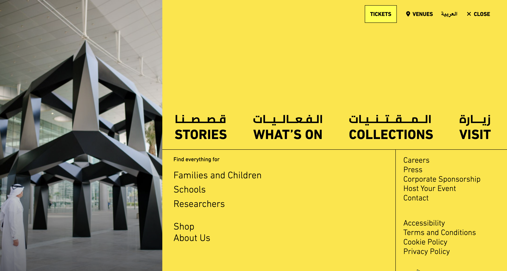
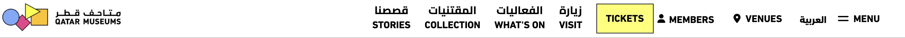
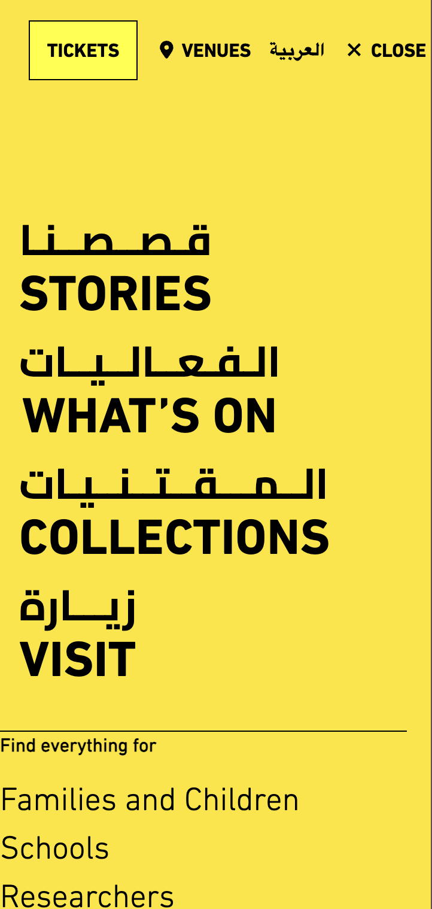
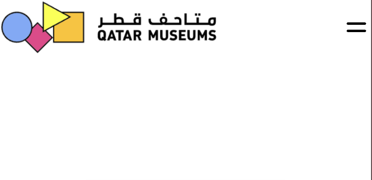

# Pleasurable User Interface

Ontwerp en maak met een team voor een opdrachtgever een interface waar gebruikers blij van worden.

De instructie vind je in: [INSTRUCTIONS.md](https://github.com/fdnd-task/pleasurable-ui/blob/main/docs/INSTRUCTIONS.md)

## Inhoudsopgave

  * [Beschrijving](#beschrijving)
  * [Gebruik](#gebruik)
  * [Kenmerken](#kenmerken)
  * [Installatie](#installatie)
  * [Bronnen](#bronnen)
  * [Licentie](#licentie)

## Beschrijving

Voor deze sprint hebben we als team gewerkt aan het opnieuw bouwen van de website van het Qatar Museum. We hebben de taken verdeeld en iedereen heeft aan zijn eigen onderdeel gewerkt. In deze Readme leggen we per teamlid uit wat hij of zij heeft gedaan, welke keuzes daarbij zijn gemaakt en hoe het proces is verlopen.

**Live:** [https://pleasurable-ui-mw41.onrender.com/](https://pleasurable-ui-mw41.onrender.com/)

---

## Gebruik

Deze website is bedoeld voor bezoekers van het Qatar Museum die informatie willen opzoeken over kunstobjecten, in zowel het Arabisch als het Engels.

---

### Fatima  Menu Overlay, Dropdown & Home Route

### De gebruiker

Mijn onderdeel was het bouwen van het overlaymenu aan de frontend en de GET/ route voor de homepage

- Als je op MENU klikt, verschijnt een overlay over het hele scherm.
- Op desktop zie je links een grote afbeelding en rechts grote navigatielinks in Arabisch en Engels.
- Op mobiel is de afbeelding verborgen en het menu simpeler, zodat het rustig en overzichtelijk blijft.

---

### Screenshots


<br>

<br>

<br>


---

#### Feedback & Feedforward

- Als je over een menu link hovert, verschijnt een subtiele pulse animatie: zo ziet de gebruiker dat je kunt klikken.
- Andere links worden roze bij hover, wat extra feedback geeft.
- De CLOSE-knop maakt duidelijk hoe je het menu weer sluit.
- Het menu opent met een rustige animatie, zodat de overgang niet stoort.

Deze keuzes zorgen ervoor dat het menu makkelijker te gebruiken is

---

#### Toegankelijkheid

- Belangrijke titels zijn alleen zichtbaar voor screenreaders via `.visually-hidden`.
- Er is een hoog contrast tussen zwarte tekst en gele achtergrond, in de huisstijl van Qatar Museums.
- Het menu werkt:
  - Zonder JavaScript
  - In oudere browsers
  - Met alleen een toetsenbord (voor mensen met een beperking)
- Afbeeldingen zijn responsive en worden lazy geladen.

---

### Ontwerpkeuzes

Ik wilde dat het menu door iedereen te gebruiken is op elk apparaat, met of zonder ondersteuning voor CSS of JS. Daarom heb ik het gebouwd in lagen (volgens Progressive Enhancement):

1. **Functional (HTML)**
   - Semantische structuur met `<nav>`, `<section>`, `<article>`, `<h1>`, `<h3>`
   - Werkt zonder styling
   - Afbeeldingen via `<picture>` met AVIF/WebP/JPG als fallback
   - RTL styling voor Arabische teksten

2. **Reliable (CSS)**
   - Eenvoudige CSS zonder afhankelijk te zijn van grid of animatie
   - Basislayout blijft werken in oude browsers

3. **Usable (CSS + JS)**
   - Responsive layout via media queries
   - Duidelijke hover, focus en active states
   - Menu opent met alleen een `#dropdown-menu`  (geen JS nodig)
   - SVG iconen

4. **Pleasurable (Interactie & Animatie)**
   - Animatie bij openen (`@keyframes dropdownEnter`)
   - Glow effect via `mix blend-mode` en `clip path`
   - Micro interactie met `subtlePulse` animatie
   - Fallback styling voor browsers zonder ondersteuning
   - Afbeeldingen worden snel geladen met lazy loading en moderne formaten

   ---

### Homepagina Route (Server-side)

Ik maakte de `GET /` route voor de homepage. Deze haalt kunstobjecten op uit de Directus API en stuurt ze naar de template:

```js
app.get('/', async (req, res) => {
  try {
    const apiResponse = await fetch('https://fdnd-agency.directus.app/items/fabrique_art_objects');
    const apiResponseJSON = await apiResponse.json();

    res.render('index.liquid', {
      artworkData: apiResponseJSON.data
    });
  } catch (error) {
    console.error('Fout bij ophalen van data:', error);
    res.status(500).send('Er ging iets mis bij het laden van de homepage.');
  }
});
```

---

### Karima

### Loading State
Voordat het formulier wordt verzonden krijg je een loading state te zien. De opacity van de button wordt verlaagd en er komt een zandloper emoji tevoorschijn. De loading state is gecodeerd met behulp van javascript en CSS.


### Succes State
Na het verzenden van het acquisition formulier krijg je een “succes state”  te zien. Het is een apart scherm die ziet nadat je een formulier succesvol hebt ingevuld. Dit is belangrijk voor de gebruikerservaring (UX) omdat het geeft duidelijkheid en het bevestigd dat alles goed is gegaan. 


### Tweetalige navigatie (Engels & Arabisch)
Vanuit de navigatie kan je switchen van een Engelse site naar een Arabische site. Op de homepage kan je vervolgens een artobject kiezen. De informatie van het artobject wordt in het arabisch opgehaald vanuit de database. Als er geen informatie beschikbaar wordt een default tekst weergegeven. Vanuit het artobject kan je ervoor kiezen een formulier in te vullen. De bezoeker kan het formulier invullen als de bezoeker een artobject wil verkopen of verdere informatie heeft over een bepaald artobject. Dit formulier kan zowel in het arabisch als engels worden ingevuld. 

De taalswitch wordt via de backend uitgevoerd. De juiste taalversie van de content wordt op basis van de URL geladen (bijvoorbeeld /en/object/:id/ of /ar/object/:id/). De Express-route vangt het :lang-deel van de URL op en geeft het door aan de parameter in de URL. In de Liquid-template wordt vervolgens bepaald welke vertalingen getoond worden:

``` LIQUID.JS

  <h1>{{ artwork.title }}</h1>
  <p>{{ artwork.summary }}</p>

  <h1>{{ artwork.titleAR }}</h1>
  <p>{{ artwork.summaryAR }}</p>

  <p>Language not supported</p>

```

---

### Tessa 


### Renzo Home page & Server build

Mijn deel van de opdracht ging over het stylen van de home pagina en het opzetten van de server met server-side JavaScript. Als feedback van de opdrachtgever had ik de opdracht gekregen de home pagina meer te laten lijken op het ontwerp. Dit heb ik gedaan door gebruik te maken van veel witruimte, de afbeeldingen zonder styling, zonder te croppen, en ook heb ik een fijne scroll-animatie toegevoegd. Voor de scroll-animatie heb ik gebruik gemaakt van een fade-in op scroll basis, zo lijkt het net alsof de afbeeldingen rustig binnenvallen op de pagina hoe verder je srollt. Ook heb ik op aanvraag van de opdrachtgever niet meer gebruik gemaakt van `display: grid`, maar gebruik gemaakt van `column` om zo de kolommen weer te geven.

``` Client-side JS voor scroll-fade-in animatie
  document.addEventListener("DOMContentLoaded", function () {
// Wacht tot de hele pagina is geladen. Pas dan begint het script te draaien, zodat het zeker weet dat alle afbeeldingen in de HTML staan.

  const elements = document.querySelectorAll('.scroll-fade-in');
  // Zoek op de pagina alle elementen met de class .scroll-fade-in. Dat zijn de afbeeldingen die je later wilt laten "fade-in"-animeren.

    const observer = new IntersectionObserver((entries) => {
      // Hier maken we een “waarnemer” (observer) aan. Die kijkt of een afbeelding in beeld komt (dus of jij ernaartoe scrollt).
        
      entries.forEach(entry => {
            if (entry.isIntersecting) {
                entry.target.classList.add('visible');
            }
        });
        //  Voor elk element dat in beeld komt controleert het script of dat element daadwerkelijk zichtbaar is op je scherm. Als dat zo is, voegt het de class visible toe
    }, {
        threshold: 0.1
    });
    // Als minstens 10% van het element zichtbaar is op het scherm, dan moet de fade-in gestart worden.

    elements.forEach(el => observer.observe(el));
  });
  // “Hou elk van die elementen in de gaten.” Dus nu weet de browser welke afbeeldingen hij moet laten animeren als je naar beneden scrollt.
```

In de server heb ik ervoor gezorgd dat wat /GET routes klaarstonden om te gebruiken door de rest van de groep, ook is er een POST en DELETE gemaakt voor de like buttons die worden gebruikt op de Admin page. 

### Feedback & Feedforward
Tijdens het hoveren over de afbeelding krijgt deze een animatie zodat het duidelijk wordt dat er op geklikt kan worden, als er op geklikt wordt, wordt de bezoeker naar de detail pagina gestuurd.

``` Feedback
.image-container {
    break-inside: avoid;
    margin-bottom: 1rem;
    display: inline-block;
    width: 100%;
    transition: transform 0.3s ease;
  }
  
  .image-container:hover {
    transform: scale(0.97);
  }
```

### Video van de homepage

https://github.com/user-attachments/assets/68cc7549-856a-4c35-b829-a718843b9944


### Amir 

---

## Installatie

Volg deze stappen om het project lokaal te draaien:

### 1️⃣ Clone de repository

Open je terminal en voer het volgende commando uit:

```bash
git clone https://github.com/RenzoWille/pleasurable-ui.git
cd pleasurable-ui

```

2️⃣ Installeer de afhankelijkheden

Installeer alle benodigde packages met:

```bash
npm install
```

3️⃣ Start de applicatie

```bash
npm start
```

4️⃣ Open in je browser

Ga in je browser naar:

```bash
http://localhost:8000
```

Nu draait je project lokaal!

---

## Bronnen

-[Qatar Museums](https://qm.org.qa) Voor inhoud, inspiratie en visuele stijl.

---

## Licentie

This project is licensed under the terms of the [MIT license](./LICENSE).
